<!-- Animated header -->

<!-- Self-typing terminal -->

<!-- Now building (auto-updated every 6h) -->

  <picture>
    <source media="(prefers-color-scheme: dark)" srcset="https://raw.githubusercontent.com/AshishB2000/AshishB2000/output/pacman-contribution-graph-dark.svg" />
    
  </picture>

  
  

  

<!-- Stats panel (auto-generated every 6h, Tokyo Night) -->

   

  
  &nbsp;
  
  &nbsp;
  

    

  <em>📬 Inbox always open — pitch me a data problem, roast my charts, or just say hi.</em>

    

  

