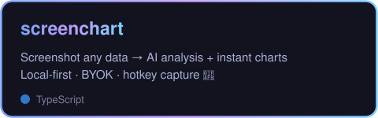
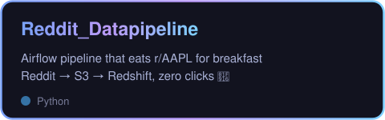
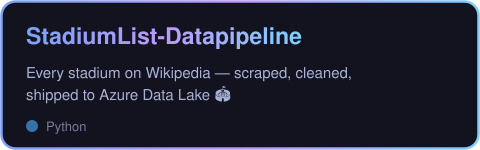

<!-- Animated header -->

  

  <picture>
    <source media="(prefers-color-scheme: dark)" srcset="https://raw.githubusercontent.com/AshishB2000/AshishB2000/output/pacman-contribution-graph-dark.svg" />
    
  </picture>

  
  

  

  

  
  

